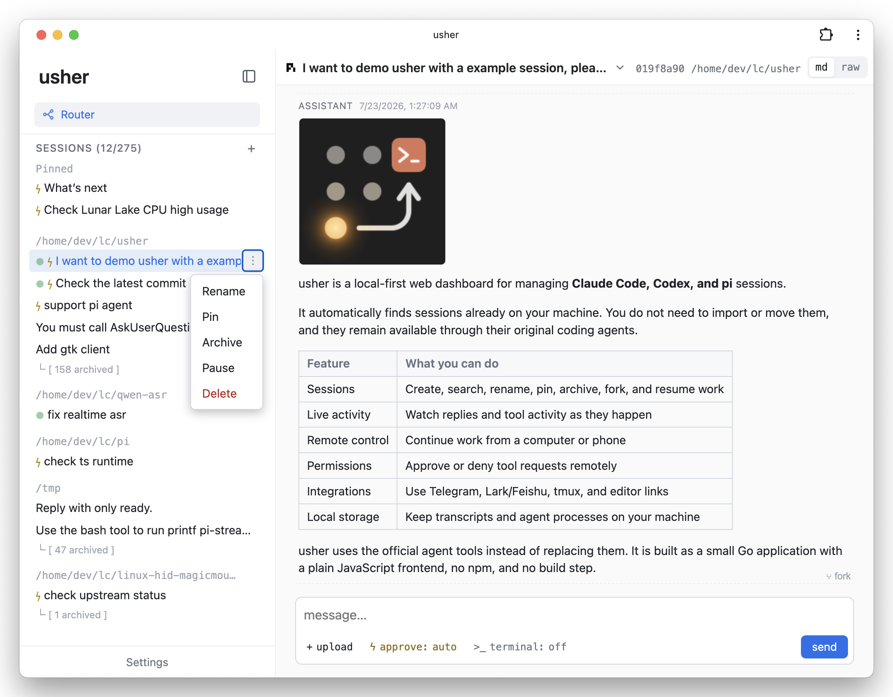
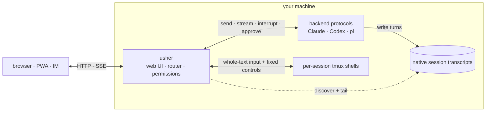

# usher

*Unified Session Hub for Extended Reach.*

Drive Claude Code, Codex, and pi sessions from any browser — including your
phone.

<p align="center">
  
</p>

usher brings the Claude Code, Codex, and pi sessions on your machine into one
hub, accessible from a browser or supported messaging app. There is nothing to
import or migrate: sessions started in a terminal or IDE appear automatically
and remain available through their native agents. Native transcripts remain the
source of truth; usher keeps only its own lightweight metadata.

## Why usher

- **No session migration.** usher discovers native sessions in place, including
  work started from a terminal or IDE. It does not copy conversations into its
  own session store, and every session remains usable through its original
  agent without usher.
- **Keep the native agents.** usher drives the official Claude Code and Codex
  CLIs, plus pi, instead of reimplementing their agent loops.
- **Work from any device.** Start a task at your desk, follow it from your phone,
  send a follow-up, or handle a permission request. The web UI installs as a
  PWA on desktop and mobile.
- **See every project together.** Discover, search, pin, archive, fork, and
  resume sessions across projects and backends from one dashboard.
- **Stay local-first.** Sessions and agent processes remain on your machine.
  Remote access is through infrastructure you control, such as Tailscale or
  Cloudflare Tunnel.
- **Simple by design, composable by default.** usher stays focused on session
  routing and works with the tools you already use — native agent CLIs,
  tunnels, editors, and messaging apps. Its implementation follows the same
  KISS principle: a static, stdlib-first Go binary with a plain-JavaScript
  frontend, no npm, and no build step.

## Quick start

You need at least one supported agent installed, signed in, and run once:
Claude Code, Codex, or pi. The optional session terminal also needs `tmux`.
On Windows, run usher inside
[WSL](https://learn.microsoft.com/en-us/windows/wsl/install).

Install and start a user-level service:

```sh
curl -fsSL https://raw.githubusercontent.com/nexustar/usher/main/install.sh | bash
```

Or install and run it directly:

```sh
go install github.com/nexustar/usher/cmd/usher@latest
usher serve
```

Open <http://127.0.0.1:7777>. Each backend is enabled automatically when its
session directory exists, and existing sessions appear without an import step.
Run `usher serve -h` for the complete option list.

To run usher in the background, use the example
[launchd property list](docs/io.github.nexustar.usher.plist) on macOS or
[systemd user unit](docs/usher.service) on Linux; each file includes setup and
log-viewing instructions.

To use usher away from the host machine, follow
[Remote access](docs/solutions/remote-access.md). Do not expose it without
first understanding the authentication guidance there.

## Main features

- **Sessions:** discover existing sessions, create new ones, resume, fork,
  rename, pin, archive, search, and switch backend or model.
- **Live work:** stream assistant output and tool activity, interrupt turns,
  answer questions, and approve or deny native backend permission requests.
- **Context:** render markdown, images, uploads, subagents, context usage, and
  compaction events from the transcript.
- **Remote control:** responsive PWA, Web Push notifications, and optional
  Telegram or Lark/Feishu integration.
- **Per-session tools:** one tmux shell per conversation and an optional deep
  link into an editor such as code-server.
- **Router:** a main chat can list, search, create, and route work to sessions.
  It uses deterministic commands by default and can optionally accept natural
  language through an OpenAI-compatible model.

## Architecture



- Sessions are discovered from native transcript files. usher stores lightweight
  metadata such as pins, archive state, and display titles, but does not copy
  conversations into its own session store or take ownership of them.
- Backend protocols run turns and report lifecycle, streaming, model, and
  permission events. usher normalizes those events for the UI.
- The main-chat agent manages sessions and routes messages. It does not answer
  substantive questions itself; the full-context coding-agent session does.
- usher does not browse the machine. File uploads, transcript image references,
  editor links, and the deliberately limited tmux shell are explicit paths, not
  a general filesystem API.

## Documentation

Solutions are task-oriented guides for combining usher with the rest of your
setup:

- [Access usher remotely](docs/solutions/remote-access.md)
- [Use usher with code-server or another editor](docs/solutions/code-server.md)
- [Connect Telegram, Lark, or Feishu](docs/solutions/im.md)

Reference material explains stable behavior that is not useful to repeat in
command-line help:

- [Security and trust model](docs/reference/security.md)
- Complete CLI options: `usher serve -h`

## Project boundaries

usher renders and drives coding-agent conversations; it is not a filesystem
browser, IDE, or replacement agent runtime. Sessions stay compatible with their
native CLIs and remain usable without usher.
